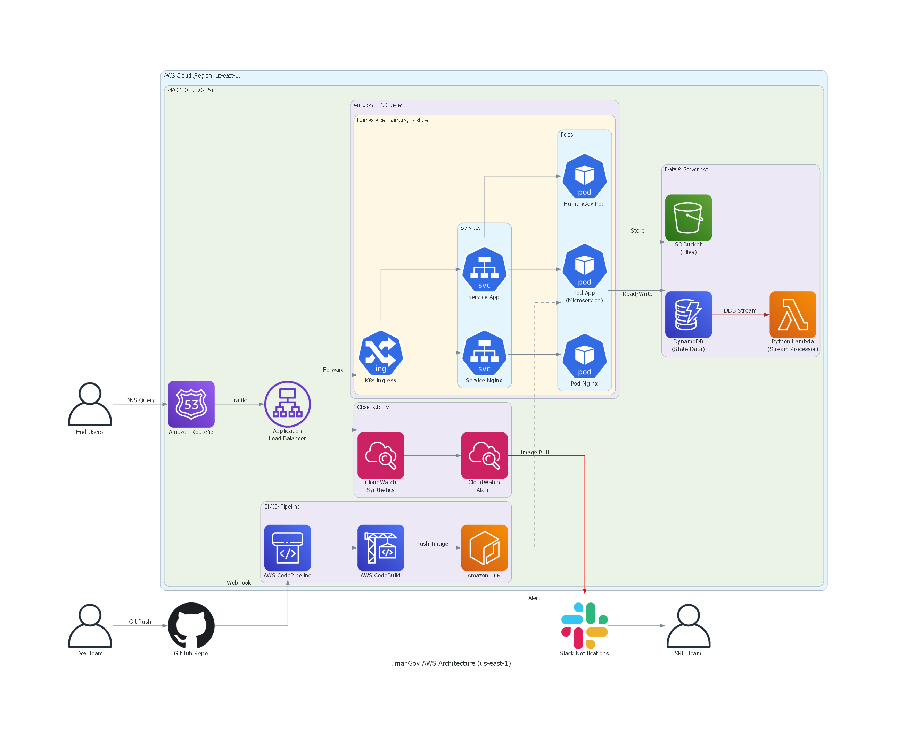

HumanGov is a secure, multi-tenant Software-as-a-Service (SaaS) Human Resources application designed for government agencies.

This project demonstrates the architecture and deployment of the HumanGov platform using a **production-grade, Zero-Trust infrastructure** on AWS. The entire stack—from the VPC networking to the Application Layer—is provisioned using **Terraform** modules and orchestrated via **Amazon EKS (Elastic Kubernetes Service)**.

The solution emphasizes **security, scalability, and automation**, moving away from manual "ClickOps" to a fully automated Infrastructure-as-Code (IaC) and Continuous Delivery workflow.

---
Key Architectural Components
Network Layer:
A custom VPC (Virtual Private Cloud) with Public and Private Subnets across multiple Availability Zones for high availability.
NAT Gateway configuration to allow secure internet access for private resources.
Compute Layer (EKS):
Amazon EKS Cluster (Control Plane) managing the container orchestration.
Managed Node Groups (EC2 t3.medium) running the application workloads.
Traffic Management:
AWS Load Balancer Controller installed via Helm.
Application Load Balancer (ALB) provisioned automatically via Kubernetes Ingress to route traffic based on host headers (e.g., california.humangovv.click).
Route 53 for DNS management.
Storage & State:
DynamoDB tables for application state management (per tenant).
S3 Buckets for file storage (per tenant).
CI/CD:
AWS CodePipeline linked to GitHub.
AWS CodeBuild for building Docker images and executing Kubernetes deployments.
Amazon ECR for storing container images.

Technologies Used
Infrastructure as Code: Terraform (Modules, State Locking with DynamoDB, Remote State in S3).
Containerization: Docker, Dockerfile.
Orchestration: Kubernetes (EKS), Helm, Kubectl.
Identity & Security: AWS IAM Roles for Service Accounts (IRSA), OIDC Provider.
Automation: AWS CodePipeline, AWS CodeBuild.
Application: Python (Flask), Gunicorn, Nginx.

Phase 1: Infrastructure Provisioning (Terraform)
I utilized a modular Terraform approach to maintain clean code and separation of concerns.
1. Remote State Management:
Configured an S3 bucket for storing the Terraform state file and a DynamoDB table for state locking to prevent concurrent modification errors.
2. Networking & EKS:
Provisioned the VPC and EKS cluster. I used a layered deployment strategy (-target) to ensure the network foundation was solid before deploying the cluster.

3. Application Resources:
Automated the creation of S3 buckets and DynamoDB tables for each US State (Tenant) dynamically.

This is a comprehensive, honest, and professional README.md. It reflects the actual work you did (Terraform Modules, EKS, Ingress, CI/CD with CodePipeline) without overclaiming features you didn't implement (like KMS or complex secrets management).
Instructions:
Create a file named README.md in your root folder.
Copy the text below.
Crucial: Wherever you see , replace the path inside the (...) with the actual path to your screenshot images.
HumanGov: SaaS Application Infrastructure on AWS EKS

📖 Executive Summary
HumanGov is a Software-as-a-Service (SaaS) Human Resources application built for government agencies.
This project documents the end-to-end implementation of a cloud-native infrastructure on AWS. Moving away from manual provisioning, I architected a modular solution using Terraform to provision the networking and compute layers, and Amazon EKS (Kubernetes) to orchestrate the microservices.
The project features a fully automated CI/CD pipeline using AWS CodePipeline and CodeBuild, ensuring that code committed to GitHub is automatically containerized, tested, and deployed to the cluster with zero manual intervention.
🏗️ Architecture Design
The infrastructure is designed for high availability and scalability, leveraging AWS managed services to reduce operational overhead.
High-Level Architecture Diagram
.png)

(Place your generated Python diagram here)
Key Architectural Components
Network Layer:

A custom VPC (Virtual Private Cloud) with Public and Private Subnets across multiple Availability Zones for high availability.

NAT Gateway configuration to allow secure internet access for private resources.

Compute Layer (EKS):
Amazon EKS Cluster (Control Plane) managing the container orchestration.
Managed Node Groups (EC2 t3.medium) running the application workloads.

Traffic Management:
AWS Load Balancer Controller installed via Helm.
Application Load Balancer (ALB) provisioned automatically via Kubernetes Ingress to route traffic based on host headers (e.g., california.humangovv.click).
Route 53 for DNS management.
Storage & State:
DynamoDB tables for application state management (per tenant).
S3 Buckets for file storage (per tenant).
CI/CD:
AWS CodePipeline linked to GitHub.
AWS CodeBuild for building Docker images and executing Kubernetes deployments.
Amazon ECR for storing container images.
🛠️ Technologies Used
Infrastructure as Code: Terraform (Modules, State Locking with DynamoDB, Remote State in S3).
Containerization: Docker, Dockerfile.

Orchestration: Kubernetes (EKS), Helm, Kubectl.

Identity & Security: AWS IAM Roles for Service Accounts (IRSA), OIDC Provider.

Automation: AWS CodePipeline, AWS CodeBuild.

Application: Python (Flask), Gunicorn, Nginx.

🚀 Implementation Guide (Step-by-Step)

Phase 1: Infrastructure Provisioning (Terraform)

I utilized a modular Terraform approach to maintain clean code and separation of concerns.

1. Remote State Management:
Configured an S3 bucket for storing the Terraform state file and a DynamoDB table for state locking to prevent concurrent modification errors.

2. Networking & EKS:
Provisioned the VPC and EKS cluster. I used a layered deployment strategy (-target) to ensure the network foundation was solid before deploying the cluster.
code
Bash
# Example of the layered deployment used to avoid dependency clashes
terraform apply -target="module.network" -target="module.eks"

3. Application Resources:
Automated the creation of S3 buckets and DynamoDB tables for each US State (Tenant) dynamically.

[Screenshot of your terminal showing terraform outputs like bucket names and ECR URL]

Phase 2: Kubernetes Configuration & Ingress

1. AWS Load Balancer Controller:
Instead of manual installation, I used the Terraform Helm Provider to install the controller directly into the cluster. This required setting up specific IAM Roles associated with the cluster's OIDC provider.

2. Ingress & Routing:
Deployed a Kubernetes Ingress resource to manage external access. This automatically triggered the creation of an AWS Application Load Balancer.

3. DNS Mapping:
Mapped the Route 53 domain humangovv.click to the ALB DNS name using CNAME records.

Phase 3: The CI/CD Pipeline
To achieve continuous delivery, I built a pipeline that connects GitHub to EKS.

1. The Build Process (CodeBuild):
Logs into the private Amazon ECR repository.
Builds the Docker image from the source code.
Tags the image with the unique Git Commit Hash for version control.
Pushes the image to ECR.

2. The Deployment Process:
Updates the Kubernetes Manifests dynamically to use the new image tag.

Authenticates with the EKS cluster using a specific IAM Role mapped in the aws-auth ConfigMap (Access Entries).

Executes kubectl apply to roll out updates without downtime.

Project Verification
1. Application Running Live
The application is accessible via the public domain with HTTPS support.

[Screenshot of the HumanGov browser window with the lock icon]
2. Kubernetes Workloads
Verification that Pods, Services, and the Load Balancer Controller are running in the default and kube-system namespaces.

[Screenshot of your VS Code terminal showing kubectl get pods]
3. ECR Repository
Validation of the container images stored in the private registry.

[Screenshot of the AWS ECR console showing image tags]

Challenges & Solutions
During the development, I encountered several complex challenges:

Challenge: CI/CD "Unauthorized" Access to EKS. CodeBuild failed to deploy because it didn't have permission to talk to the cluster.

Solution: I updated the EKS Access Entries (access_entries) in Terraform to explicitly map the CodeBuild IAM Role to the system:masters group in Kubernetes.

Simeon Akinnuoye
Cloud Infrastructure & DevOps Engineer
www.linkedin.com/in/simeon-akinnuoye-9ab160183
